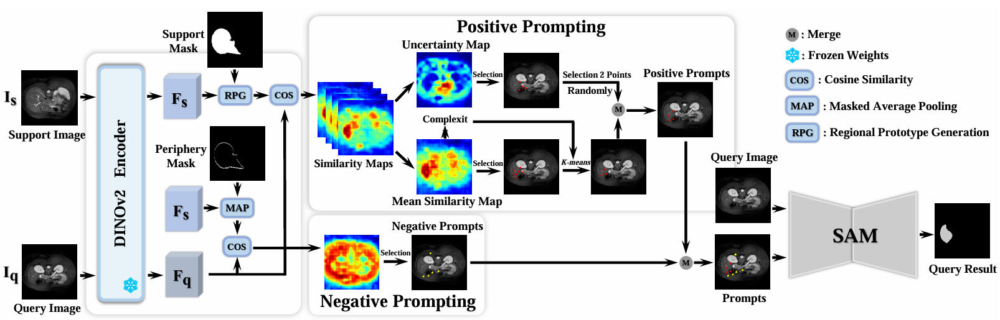

<div align="center">

<h1>🚲MAUP: Training-free Multi-center Adaptive Uncertainty-aware Prompting for Cross-domain Few-shot Medical Image Segmentation </h1>

<p>
 <strong>Yazhou Zhu, Haofeng Zhang<sup>*</sup>
 

</p>


<p align="center">


</div>

## Abstaract

Cross-domain Few-shot Medical Image Segmentation (CD-FSMIS) is a potential solution for segmenting medical images with limited annotation using knowledge from other domains. The significant performance of current CD-FSMIS models relies on the heavily training procedure over other source medical domains, which degrades the universality and ease of model deployment. With the development of large visual models of natural images, we propose a training-free CD-FSMIS model that introduces the Multi-center Adaptive Uncertainty-aware Prompting (MAUP) strategy for adapting the foundation model Segment Anything Model (SAM), which is trained with natural images, into the CD-FSMIS task. To be specific, MAUP consists of three key innovations: (1) K-means clustering based multi-center prompts generation for comprehensive spatial coverage, (2) uncertainty-aware prompts selection that focuses on the challenging regions, and (3) adaptive prompt optimization that can dynamically adjust according to the target region complexity. With the pre-trained DINOv2 feature encoder, MAUP achieves precise segmentation results across three medical datasets without any additional training compared with several conventional CD-FSMIS models and training-free FSMIS model.


</div>

## Dependencies

```
dcm2nii
json5==0.8.5
jupyter==1.0.0
nibabel==2.5.1
numpy==1.22.0
opencv-python==4.5.5.62
Pillow>=8.1.1
sacred==0.8.2
scikit-image==0.18.3
SimpleITK==1.2.3
torch==1.10.2
torchvision=0.11.2
tqdm==4.62.3
segment-anything=1.0
transformers=4.49.0
```

</div>


## Datasets 


</div>

## Inference 

#### Inference on Abd-MRI
Run `./script/inference_abd_mri.sh` 

#### Inference on Abd-CT 
Run `./script/inference_abd_ct.sh` 

#### Card-MRI
Run `./script/inference_card_mri.sh`


